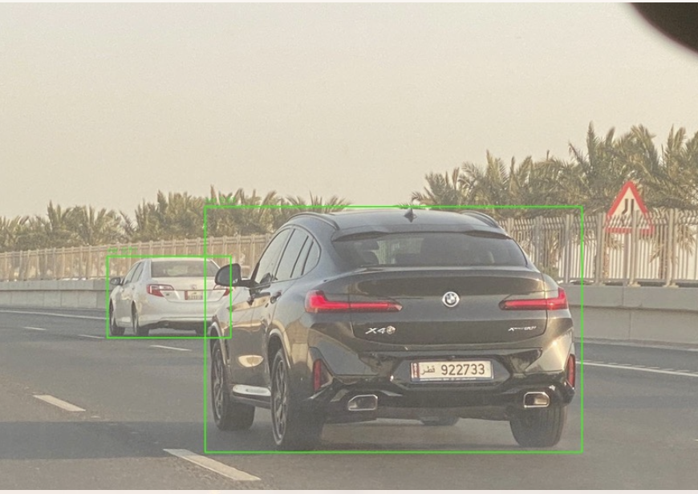
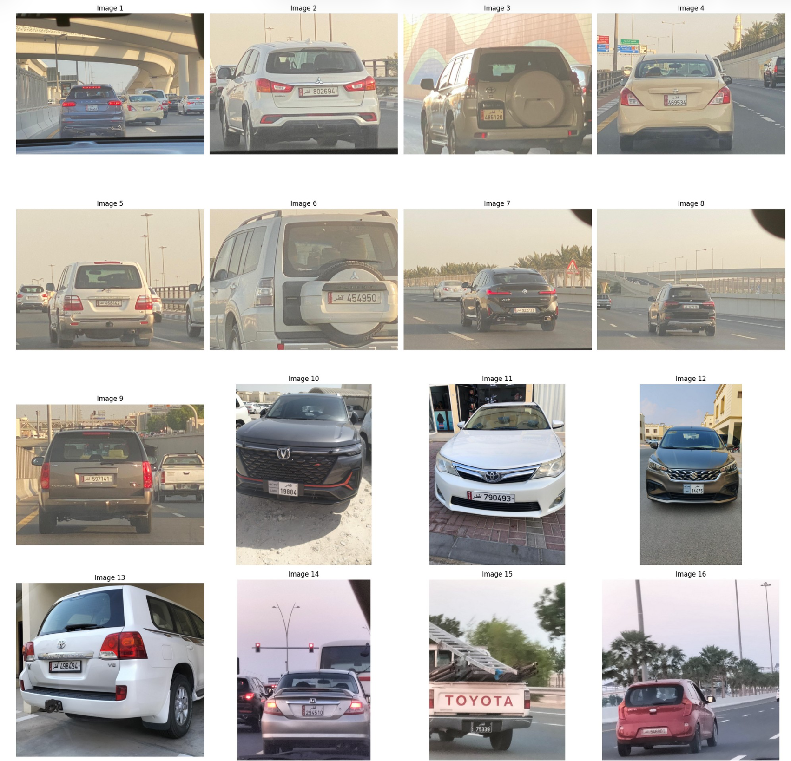
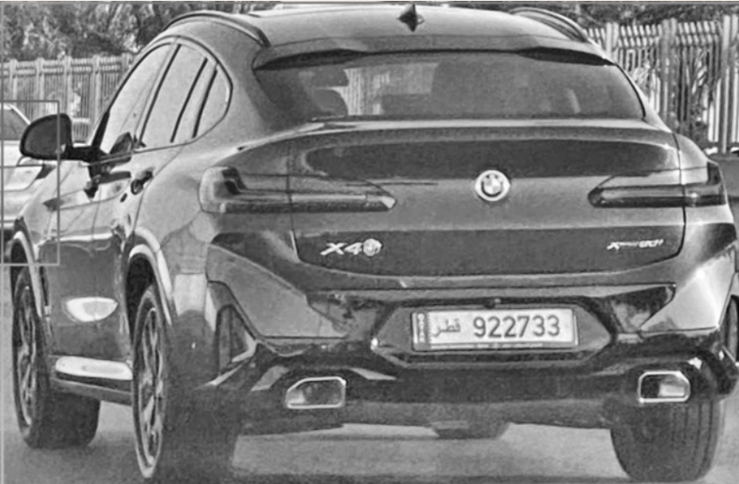
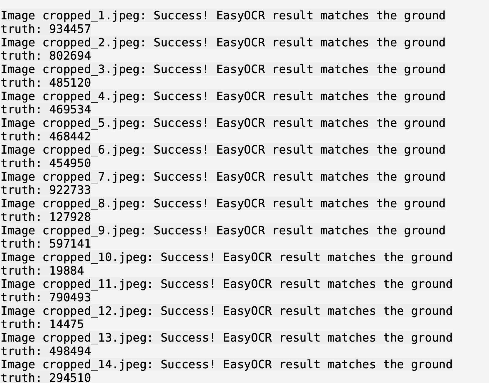
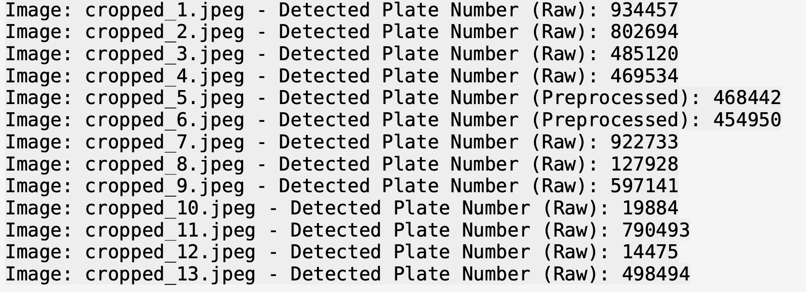

# QPlate Vision

A computer vision–based Automatic License Plate Recognition (ALPR) system developed to detect and recognize **Qatari vehicle license plates** using **YOLOv5**, **OpenCV**, and **EasyOCR**.

---

## Overview

QPlate Vision is an Automatic License Plate Recognition (ALPR) system designed specifically for Qatari vehicles. The project combines object detection, image preprocessing, and Optical Character Recognition (OCR) to accurately identify license plate numbers under real-world driving conditions.

The recognition pipeline detects vehicles and license plates, enhances image quality through preprocessing techniques, extracts text using OCR, and evaluates recognition accuracy using a manually created ground-truth dataset.

---

## Features

- Vehicle detection using YOLOv5
- Automatic license plate localization
- Image preprocessing with OpenCV
- Optical Character Recognition using EasyOCR
- Ground-truth dataset creation for evaluation
- OCR accuracy testing and comparison
- Optimized for Qatari license plates
- Recognition performance analysis
- Automated processing pipeline

---

## Screenshots

| Dataset | Vehicle Detection | Pre Processed Car |
|---------|-------------------|-----------------|
|  |  |  |

| OCR Results | Evaluation |
|-------------|------------|
|  |  |

---

## Tech Stack

### Programming Language

- Python

### Deep Learning

- YOLOv5

### Computer Vision

- OpenCV

### OCR

- EasyOCR

### Data Processing

- NumPy
- Matplotlib

### Development Environment

- Jupyter Notebook

---

## Recognition Pipeline

The application follows a sequential computer vision pipeline for vehicle and license plate recognition.

```text
Input Vehicle Image
        │
        ▼
Vehicle Detection (YOLOv5)
        │
        ▼
License Plate Detection
        │
        ▼
Image Cropping
        │
        ▼
OpenCV Image Preprocessing
        │
        ▼
EasyOCR Text Recognition
        │
        ▼
Ground Truth Comparison
        │
        ▼
Recognition Accuracy Evaluation
```

---

## My Contribution

I contributed to the development and evaluation of the complete recognition pipeline.

My responsibilities included:

- Integrating the YOLOv5 detection model
- Preparing and organizing the image dataset
- Implementing image preprocessing using OpenCV
- Integrating EasyOCR for text extraction
- Developing the OCR evaluation workflow
- Creating the ground-truth dataset for accuracy testing
- Comparing OCR predictions with expected results
- Debugging and optimizing the recognition pipeline
- Evaluating system performance across multiple test images

---

## Challenges

One of the main challenges was maintaining reliable OCR performance under varying real-world conditions.

Key challenges included:

- Detecting plates under different lighting conditions
- Handling image blur and viewing angles
- Processing bilingual Qatari license plates
- Improving OCR accuracy through preprocessing
- Creating reliable ground-truth data for evaluation
- Reducing false detections while maintaining recognition speed

---

## Results

The developed system successfully demonstrated an end-to-end Automatic License Plate Recognition pipeline capable of:

- Detecting vehicles from road images
- Localizing license plates automatically
- Extracting license numbers using OCR
- Comparing recognized text against ground truth
- Evaluating recognition accuracy across multiple samples

---

## Future Improvements

Planned enhancements include:

- Real-time video processing
- Custom-trained OCR model
- Support for multiple GCC license plate formats
- Improved nighttime recognition
- Deep learning–based image enhancement
- REST API deployment
- Web dashboard for live monitoring
- Performance optimization for edge devices

---

## Project Structure

```text
qplate-vision/
│
├── Car Plates/
├── Cropped Plates/
├── Detected Images/
├── Error Images/
├── Processed Plates/
├── P Images/
├── yolov5/
│
├── Project_G2.ipynb
├── calculation.txt
├── carplates.txt
├── EasyOcr.txt
├── OCR_G2_DEMO.pdf
├── OCR_G2.pptx
├── yolov5m.pt
├── yolov5s.pt
└── README.md
```

---

## Getting Started

### Clone the repository

```bash
git clone https://github.com/yourusername/qplate-vision.git
```

### Install dependencies

```bash
pip install -r requirements.txt
```

### Run the notebook

```bash
jupyter notebook Project_G2.ipynb
```

---

## Project Goal

This project demonstrates my ability to develop an end-to-end computer vision application by combining deep learning, image processing, Optical Character Recognition, dataset preparation, and performance evaluation to solve a real-world license plate recognition problem.

---

## 📄 License

This project was developed as part of my software engineering portfolio.